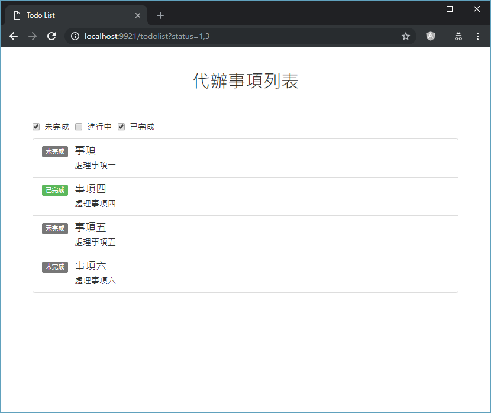

## 問題：

### 渲染頁面 /todolist?status=1,3，透過 API /api/todo/status, /api/todo/list

    GET /api/todo/status
    ```
        Response: [{
            id: 1, name: '未完成'
        },{
            id: 2, name: '進行中'
        },{
            id: 3, name: '已完成'
        }]
    ```

    POST /api/todo/list
    ```
        Response: [{
            id: 1, status: 1, name: '事項一', description: '處理事項一'
        },{
            id: 2, status: 2, name: '事項二', description: '處理事項二'
        },{
            id: 3, status: 2, name: '事項三', description: '處理事項三'
        },{
            id: 4, status: 3, name: '事項四', description: '處理事項四'
        },{
            id: 5, status: 1, name: '事項五', description: '處理事項五'
        },{
            id: 6, status: 1, name: '事項六', description: '處理事項六'
        }]
    ```

    
